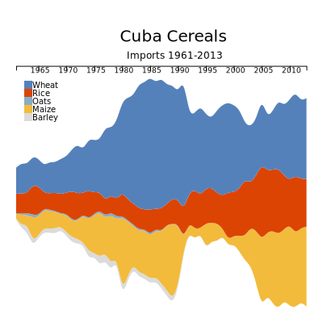
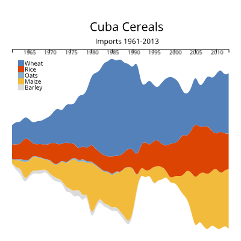

# cuba-streamgraph-d3

Streamgraph showing Cuba's cereal imports from 1961-2013 (data from FAO STAT).  Hover over the graph to show grain type.
The button to update streamgraph with the Export data (same time period) is currently under development, as well as a color-coded legend.

Below, there is an SVG of the streamgraph, redesigned for course purposes, which does include a legend.

